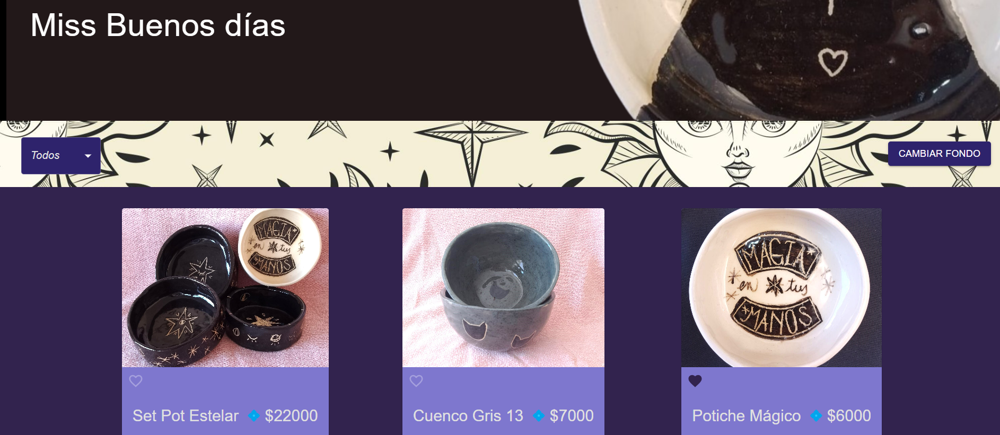
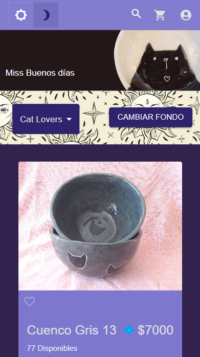
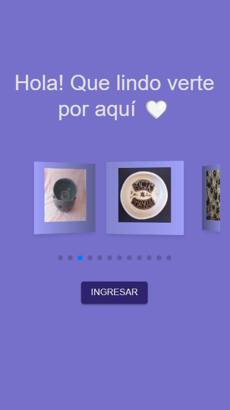
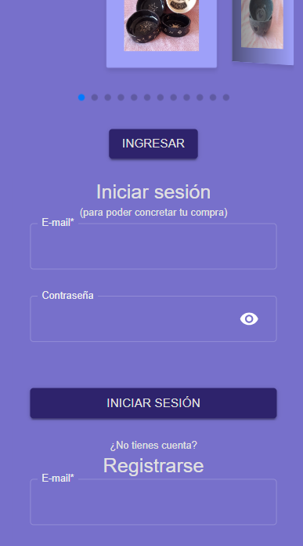
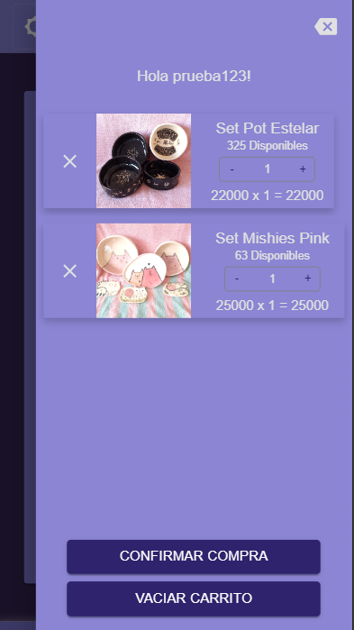
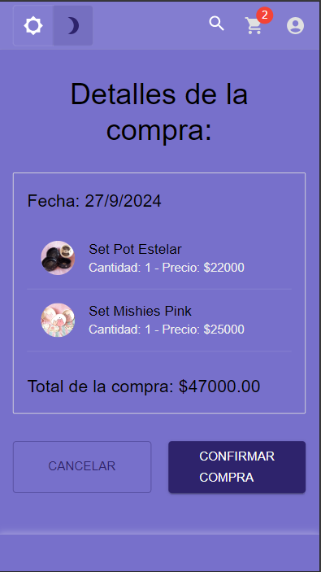
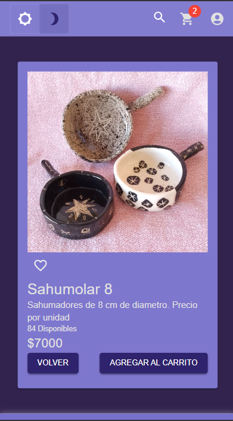
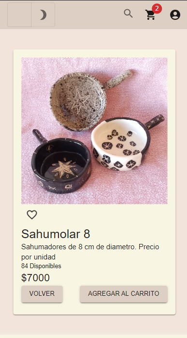

# Miss Buenos Días - E-commerce Artesanal
Miss Buenos Días es una tienda en línea dedicada a la venta de piezas artesanales de cerámica con motivos gatunos y astrológicos en su mayoría. Entre los productos encontrarás platos, cuencos, potiches, sahumadores, pines, etc., todos hechos a mano con el cuidado y la calidad que caracteriza a la marca.

## Descripción General
El sitio ofrece una experiencia responsiva, intuitiva y simple, diseñada para que cualquier usuario pueda navegar y explorar fácilmente los productos. Al ingresar, los visitantes son recibidos en una página de bienvenida que les sugiere registrarse o iniciar sesión. También tienen la opción de entrar de forma anónima, pero algunas acciones, como agregar productos al carrito o consultar el perfil, estarán restringidas para usuarios no registrados.

El proceso de compra es sencillo: los productos pueden ser agregados al carrito, donde es posible modificar el pedido antes de confirmarlo. Una vez finalizada la compra, el cliente es puesto en contacto directo con la artesana, facilitando una atención personalizada y directa.

## Características principales:
- Inicio de sesión o acceso anónimo (con funciones limitadas).
- Modo Oscuro / Modo Claro.
- Carrito de compras editable.
- Contacto directo con la vendedora al confirmar la compra.
- Productos artesanales con diseños únicos de Miss Buenos Días.

## Proyecto en construcción:
Este proyecto está en su primera etapa de desarrollo. En el futuro se incluirá un panel de administración donde los administradores podrán:

- Subir nuevos productos.
- Modificar productos existentes.
- Eliminar productos si es necesario.

## Tecnologías Utilizadas
JavaScript: Lenguaje principal para la lógica del proyecto.
React: Biblioteca para crear la interfaz de usuario de forma dinámica y eficiente.
Material-UI: Utilizado para diseñar componentes visuales modernos y accesibles.
React Router: Para manejar las rutas y la navegación entre las diferentes páginas del sitio.
Swiper JS: Implementado para crear un carrusel interactivo de productos.
Firebase: Se utiliza para gestionar la base de datos de productos, la autenticación de usuarios y las interacciones del carrito.

Proyecto creado por Trinidad Lari, todos los derechos reservados.

- [Repositorio](https://github.com/TrinidadLari/e-commerce-MissBuenosDias) 
- [Deployado](https://e-commercemissbuenosdias.web.app/) 